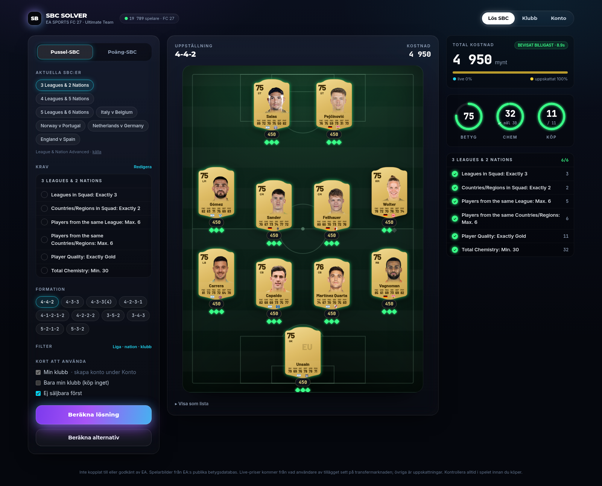
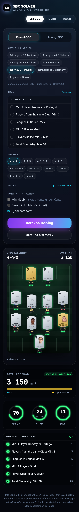

# FUT SBC Solver

Hittar den billigaste lösningen på Squad Building Challenges i EA SPORTS FC 27 Ultimate Team,
med din egen klubb och crowdsourcade livepriser.

- **Poäng-SBC:er (de flesta i FC 27):** exakt billigaste sättet att nå målpoängen
  (dynamisk programmering, millisekunder). Se `docs/streamlined.md`.
- **Pussel-SBC:er:** OR-Tools CP-SAT. Lagbetyg via exakt uppdelning per betygssumma (bevisat
  billigast på några sekunder), chemistry enligt FC 27-regler, krav på liga, nation, klubb,
  raritet och antal olika.
- **Spelardatabas:** alla FC 27-baskort (19 789 st.) från EA:s publika betygsdatabas.
  Specialkort lärs in från det användarna ser i Web App.
- **Klubb och livepriser:** ett Chrome-tillägg som bara läser (se `extension/README.md`).
- **Förval:** verifierade FC 27-SBC:er med källa (`backend/app/sbc/presets.py`).
- **App:** React + Tailwind, mörkt FC 27-tema med glaspaneler. Truppen visas på en plan i vald formation med kort i spelets layout (aktuella FC 27-betyg och stats, ansikte, flagga, klubbmärke), chemistry-markeringar, progressringar för betyg och chemistry, kraven i spelets format med bockar och alternativa lösningar. Fungerar i mobilen. Varje pris märks live, uppskattat eller
  standard.

| | |
|---|---|
|  |  |

## Kom igång

```bash
docker compose up -d --build        # Postgres, Redis, backend :8000, app :8080
```

Vid första start importerar backenden FC 27-spelarna från EA (cirka 200 sidor, några
minuter). Öppna sedan http://localhost:8080, skapa ett konto under **Konto** och klistra in
kopplingskoden i tillägget.

### Utveckling

```bash
python -m venv .venv && .venv/bin/pip install -r backend/requirements.txt pytest
cd backend && ../.venv/bin/python -m pytest          # lösare, API, priser, import
cd frontend && npm install && npm test && npm run dev  # app på :5173 (proxar /api)
cd extension && npm install && npm test             # parsning
node extension/test/e2e.mjs <seedad sqlite-db>      # Chromium + tillägg + backend
```

## Dokumentation

- `docs/architecture.md`: arkitektur, kretsbrytare, index, IndexedDB
- `docs/streamlined.md`: FC 27:s poäng-SBC:er, poängtabell och lösare
- `docs/rating.md`, `docs/chemistry.md`: formler och regler (FC 26/FC 27)
- `docs/datasources.md`: EA:s betygsdatabas, Web App-data, Futbin (avstängd)
- `docs/prices-and-club-research.md`: prisleverantörer och EA:s Community API

## Principer

- Aldrig EA-inloggning i appen. Tillägget läser aldrig lösenord, cookies eller sessionsnyckel.
- Inga automatiska köp, listningar eller marknadssökningar. Priser kommer bara från vad
  användare själva ser.
- Inte kopplat till eller godkänt av EA. Användning av tillägget sker på egen risk enligt
  EA:s villkor.
