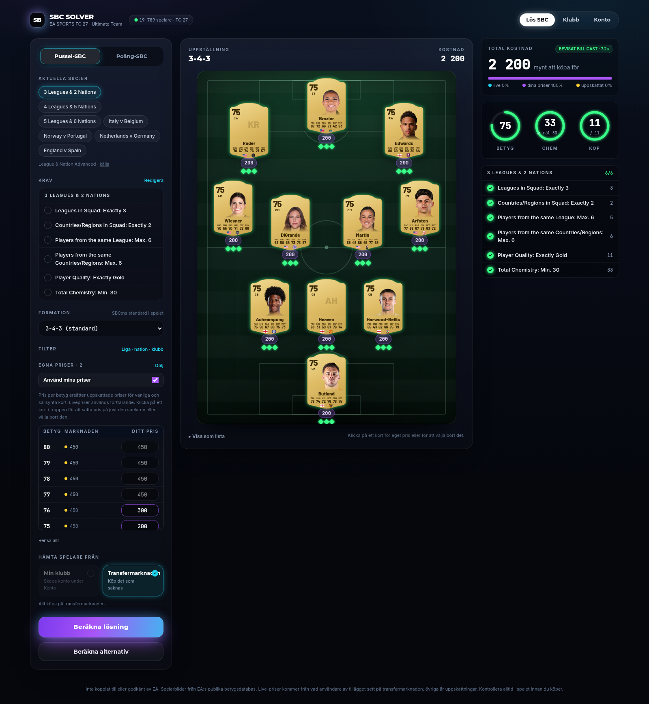

# Arkitektur

```
Chrome-tillägg ──(JSON som webbappen redan hämtat)──▶ FastAPI ──▶ PostgreSQL
                                                     │   ▲          (spelare, priser, klubb, SBC)
React (mobil/desktop) ◀── /api/sync (delta) ─────────┤   └── Redis (cache, jobbkö)
   │  IndexedDB: spelare, priser, klubb              │
   └── POST /api/solve ─────────────────────────────▶ Solver-process (OR-Tools CP-SAT)
```

**Lösaren körs på servern, inte i webbläsaren.** CP-SAT är en C++-motor med flera trådar.
I en mobilwebbläsare finns ingen motsvarighet, och en JS-sökning över 17 000 spelare skulle
vara både långsammare och sämre (ingen optimalitetsgaranti). Klienten skickar krav och får
en trupp tillbaka.

## 1. Kretsbrytare (inga oändliga sökningar)

| Lager | Var | Skydd |
|---|---|---|
| 1 | `solver/cpsat.py` | Gemensam deadline för hela anropet, inklusive alternativa lösningar. `MAX_TIME_S = 30`, poolen och antalet alternativ kapas. Lösaren returnerar alltid, med `OPTIMAL`, `FEASIBLE` (bästa hittills, ej bevisad), `INFEASIBLE` ("Ingen lösning finns") eller `UNKNOWN` ("Ingen lösning hittades inom tidsgränsen"). |
| 2 | `solver/runner.py` | Lösningen körs i en separat process. Svarar den inte inom deadline + 10 s dödas processen. En semafor tillåter högst 2 samtidiga lösningar. |
| 3 | `frontend/src/lib/guard.ts` | `fetchWithTimeout` (AbortController) och `runWorker` för tungt klientarbete i en Web Worker som `terminate()`-as vid timeout. Det stoppar tråden även mitt i en loop. |

### Algoritmen: varför den inte "fastnar"
Lagbetyget är olinjärt (korrektionen beror på snittet). I stället för en svag global
formulering delas problemet upp per betygssumma S. För fast S är villkoret **linjärt**, så
varje delproblem är en ren 0/1-modell som CP-SAT bevisar optimal på ~50 ms. S gås igenom
nedåt med kostnadsgräns (cutoff), och en analytisk gräns (`_excess_bound_ok`) bevisar när
inga lägre S kan fungera. Loopen är ändlig (S är ett heltal i ett begränsat intervall) och
avbryts dessutom av deadline.

### Chemistry: först en lösning, sedan beviset
För chemistry är CP-SAT:s undre gräns stark direkt, men att *hitta* en första squad med hög
chemistry kunde ta längre än hela tidsgränsen. Lösaren arbetar därför i steg:

0. **Konstruktiv heuristik** (`heuristics.py`, millisekunder): fyll formationen i position med
   de billigaste korten ur en enda liga/nation/klubb (8+ från en liga = +3 var), med några
   betygsgolv. Varje kandidat kontrolleras av den oberoende regelkontrollen.
1. **Förlösning** på en chemistry-medveten pool (`chem_pool`): de grupper som billigast fyller
   formationen i position, plus grupper som kraven nämner (~500 kort, 35 % av tiden).
2. **Huvudlösning** på hela poolen med bästa kända squad som ledtråd och kostnadstak.
3. **Polering:** samma kostnad, lägsta totala betyg (spara användarens bättre kort).

Positioner modelleras per positions*typ* (två CB-platser är utbytbara), och målet är ren
kostnad. Rating som tiebreaker i målet gjorde beviset onödigt svårt.

Mätt på alla 19 789 FC 27-kort (platshållarpriser, 30 s gräns):

| SBC | Före | Efter |
|---|---|---|
| 84 rated | bevisat, ~4 s | bevisat, ~4 s |
| 33 chem | ingen lösning / timeout | **bevisat, ~5 s** |
| Liga (≥3 PL) + 25 chem + 80 rated | ingen lösning | giltig, ~5 % från 240 s-referens |
| Hybrid (5 ligor, max 3/liga, 15 chem, 78) | giltig | giltig, ~11 % från 240 s-referens |

Kombinationen betyg + chemistry bevisas fortfarande inte inom tidsgränsen, och UI:t säger då
"bästa inom tidsgränsen".

Svåra hybrider ("exakt 5 ligor och 6 nationer, 25 chem, betyg 81") hittar ingen första
squad med vanlig sökning. Steget `_chem_first` maximerar chemistry under övriga krav och
stoppar vid första giltiga squad (cirka 8 s), som huvudmodellen sedan förbättrar.
**Känd begränsning:** för just "5 Leagues & 6 Nations" blir resultatet giltigt men dyrt och
varierar mellan körningar (18 900–51 900 med platshållarpriser på 30 s, medan guider anger
~6 000 i spelet).

## 2. O(1)-uppslag

- **Server:** `solver/index.py` (`CardIndex`) byggs en gång i O(N): `by_id`, `by_base`,
  `by_nation`, `by_league`, `by_club`, `by_rating`, `by_position`. Modellbygget skapar
  placeringsvariabler via `by_position[pos]` och håller listor per spelare och per plats.
  Den tidigare kvadratiska sökningen över alla variabler per spelare är borta.
- **Klient:** `PlayerIndex` i `playerCache.ts`, med `Map` per id/nation/liga/klubb/betyg och
  `liga:betyg`. Varje hink är sorterad billigast först, så "billigaste N" är en `slice`.

## 3. IndexedDB (klientens lokala databas)

`frontend/src/lib/playerCache.ts` (biblioteket `idb`):

| Store | Nyckel | Index |
|---|---|---|
| `players` | kort-id | rating, nation, league, club, [league, rating], [nation, rating] |
| `prices` | kort-id | – (separat, så att prisuppdateringar inte skriver om spelarposter) |
| `club` | kort-id | – |
| `meta` | `syncVersion`, `lastSyncAt` | – |

- **Deltasynk:** `GET /api/sync?since=<version>` ger bara ändrade rader plus borttagna id:n
  (`hasMore` för sidindelning, `full: true` om klienten är för gammal).
- **En transaktion per batch** med parallella `put()`. Snabbt och atomärt: en misslyckad
  synk lämnar den gamla versionen orörd (testat).
- Synken körs i `sync.worker.ts` så att JSON-parsning och skrivning inte låser UI:t.
- `navigator.storage.persist()` begär att data inte rensas vid lagringsbrist.
- Uppskattad storlek: ~17 000 spelare × ~150 B + priser ≈ 3–4 MB, långt under
  IndexedDB-kvoten (normalt en andel av diskutrymmet, hundratals MB).
- Schemaändringar görs med versionerade `upgrade`-block.

## 4. Skalning inför publik lansering

| Del | Fil | Vad den gör |
|---|---|---|
| Kortkatalog i minnet | `backend/app/catalogue.py` | Alla ~20 000 kort och priser per plattform hålls i minnet och uppdateras med deltafrågor på synkversionen (högst var 30:e sekund). Att ta fram lösarens kort tog ~1,3 s per anrop; nu ~0,3 ms. Bara användarens klubb läses per anrop. |
| Delad lösningscache | `backend/app/solve_cache.py` | En trupp som köps helt på marknaden är densamma för alla. Svaret sparas i Redis (eller i minnet utan Redis) och återanvänds så länge det håller: samma pris-/kortversion, eller yngre än 30 min och varje kort som köps kostar fortfarande samma sak. Gratisförfrågningar svarar då på ~0,01 s i stället för upp till 30 s. |
| Ingen rusning | `solve_service.py` | Identiska förfrågningar som kommer medan en löses väntar på samma svar. När en ny SBC släpps och tusen användare öppnar den körs en lösning, inte tusen. |
| Förvärmning | `solve_service.warm_loop` | Var 15:e minut löses alla aktiva förval (konsol och PC) i bakgrunden, men bara när ingen användare väntar på lösaren. Utgångna SBC:er hoppas över. |
| Kö med tak | `solver/runner.py` | Högst 2 samtidiga lösningar och högst 6 som väntar. Fler ger HTTP 503 med "Många löser SBC:er just nu" i stället för att timeouta efter en minut. |
| Gräns per användare | `api/routes.py` | 20 lösningar per minut per konto eller IP (`X-Real-IP` från nginx; exponera därför inte port 8000 direkt mot internet i drift). |
| Komprimering | `frontend/nginx.conf` | gzip för JSON, JS och CSS. |

Personliga förfrågningar (med egen klubb, egna priser, bortvalda kort eller låsta platser)
cachas inte, eftersom svaret bara gäller den användaren.

Inställningar (miljövariabler): `CATALOGUE_REFRESH_S`, `SOLVE_CACHE_TTL_S`,
`WARM_PRESETS_MIN`, `WARM_PLATFORMS`, `SOLVER_QUEUE`, `SOLVE_RATE_PER_MIN`.

## 5. Egna priser

Användaren kan sätta egna priser i appen, utan konto. De sparas i webbläsaren
(`frontend/src/lib/ownPrices.ts`) och skickas med varje lösning (`prices` i `/api/solve`
och `/api/solve/streamlined`):

- **Pris per betyg** ersätter uppskattade priser för vanliga och sällsynta kort med det
  betyget. Livepriser används fortfarande, eftersom de är faktiska observationer.
- **Pris per spelare** (klicka på ett kort i truppen) ersätter alla priser för just det
  kortet, även för specialkort som annars aldrig köps på ett uppskattat pris. För egna
  säljbara kort blir säljvärdet 95 % av det priset.
- **Använd inte** (samma ruta) skickas som `excluded_ids`.

Priserna märks "egna" (lila) i truppen och i kostnadsrutan. `GET /api/prices/ratings` ger
marknadens billigaste kort per betyg som jämförelse i prispanelen.

| | |
|---|---|
|  |  |
